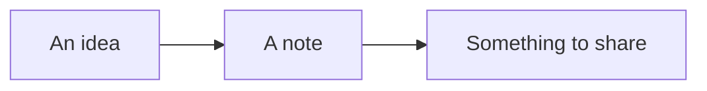

# Field notes

A few good ideas, ready to take with you.

## A slower Saturday

Take the long way to the coast. Bring a notebook, find a quiet spot, and leave room for a detour.

- [x] Pick a walking route
- [x] Pack a picnic
- [ ] Leave the afternoon open

> Notice the small things.

## Along the way

| Stop | A little time for |
| --- | --- |
| Market | Coffee and fresh bread |
| Coast | Sketches and sea air |
| Home | A page of field notes |

## Keep it simple

An idea can start anywhere. A plain file makes it easy to keep, change, and share.

```text
Read a little.
Write something down.
Pass it on.
```

## From idea to page



## A small equation

The area of a circle is $A = \pi r^2$.

$$
\frac{1}{2} + \frac{1}{4} = \frac{3}{4}
$$
